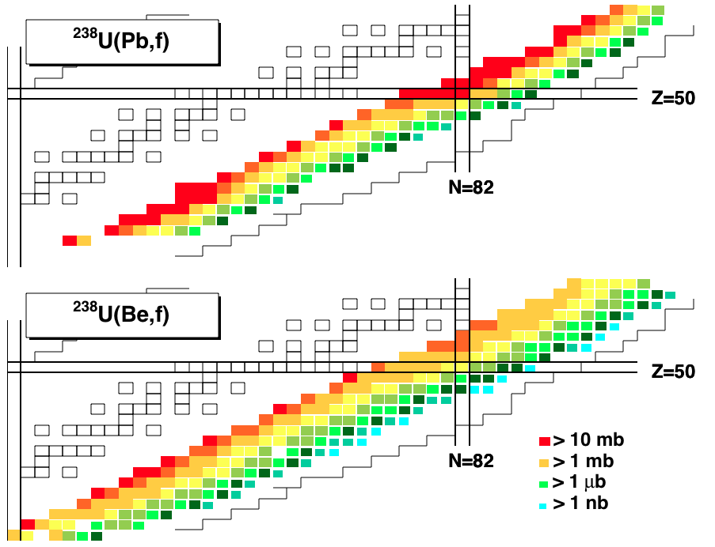

# Macro for plotting the chart of nuclides with cross section data on top #

##David Perez Loureiro##

The data folder contains the data files, as well as the definition of proton and neutron-rich limits

The  Chart.C file contains a series of functions to produce the nuclide chart

To plot the figure just type:

`$root plot_fig3.C` on a terminal.

You should get the following canvas:

