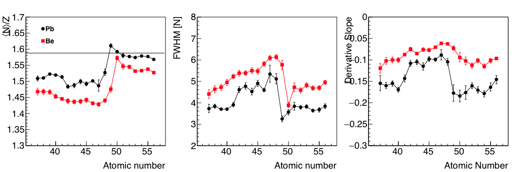

# Macro for plotting fission observables #

##David Perez Loureiro##

The data folder contains the data files to be plotted.

The slopes.C macro calculates the derivatives and plot them

To plot the figure just type:

`$root plot_fig7.C` on a terminal.

You should get the following canvas:

